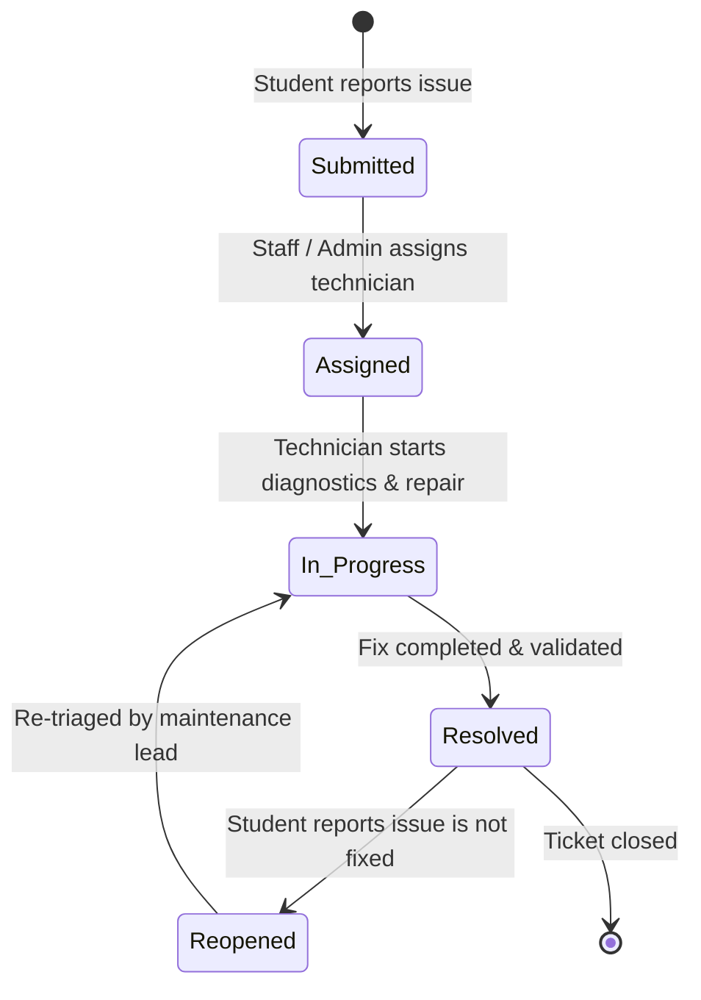

# 🎓 CampusFlow — Second Year Challenge (ENGINEER)

> **A Production-Grade Full-Stack University Operations, Issue Workflow & Resource Management System**  
> Built with **React 19**, **Node.js / Express**, **SQLite (Persistent Relational Database)**, and **JWT Role-Based Access Control**.

---

## 📌 1. Project Overview & Problem Statement

Modern university campuses struggle with fragmented communication across facilities maintenance, student IT support, room bookings, and campus event registrations. Issues reported by students frequently get lost without status tracking, clear assignees, or audit history.

**CampusFlow** solves this problem by providing an integrated, full-stack campus management engine featuring:
- **Role-Based Workflows**: Distinct permissions and tailored views for **Students**, **Staff / IT Technicians**, and **Administrators / Deans**.
- **Interactive State Machine**: Complete issue lifecycle management (`Submitted` ➔ `Assigned` ➔ `In Progress` ➔ `Resolved` ➔ `Reopened`).
- **Persistent Relational Database**: SQLite relational storage with Foreign Keys, indexed lookups, and transaction safety.
- **Event RSVP Engine**: Live seat tracking, waitlists, and instant 1-click RSVP with celebratory confetti.
- **Facility & Equipment Directory**: Real-time booking requests, duration enforcement, and staff approval queues.
- **Operational Analytics Dashboard**: Incident resolution rate SLAs, category bottlenecks, department throughput leaderboards, and CSV exports.

---

## 🛠️ 2. Technology Stack

| Layer | Technology | Rationale & Design Decision |
|---|---|---|
| **Frontend** | **React 19 + Vite** | Blazing fast client hydration, modern hooks, declarative state. |
| **Styling** | **Vanilla CSS + Glassmorphism** | Custom dark-slate theme, glowing KPI cards, responsive layout, zero bulky CSS dependencies. |
| **Icons & Micro-Interactions** | **Lucide Icons & Canvas-Confetti** | Crisp SVGs and celebratory micro-animations on resolving issues & RSVPs. |
| **Backend API** | **Node.js & Express 5** | RESTful architectural pattern, unified error handling middleware, request validation. |
| **Database** | **SQLite (`better-sqlite3`)** | Persistent relational storage, WAL mode, foreign key constraints, zero external daemon config. |
| **Authentication** | **JWT (`jsonwebtoken`) + BCrypt** | Stateless bearer token authentication with encrypted password hashing (salt rounds = 10). |
| **Testing** | **Automated Node Test Suite** | 16 comprehensive integration test cases covering auth, RBAC, CRUD, and workflow state transitions. |

---

## 🗄️ 3. Relational Data Models

```
┌──────────────────┐       1:N       ┌────────────────────────┐
│      USERS       │ ──────────────< │         ISSUES         │
│ ──────────────── │                 │ ────────────────────── │
│ id (PK)          │                 │ id (PK)                │
│ name             │                 │ title, description     │
│ email (UNIQUE)   │                 │ category, priority     │
│ password_hash    │                 │ status (STATE MACHINE) │
│ role (RBAC)      │                 │ location               │
│ department       │                 │ student_id (FK)        │
└────────┬─────────┘                 │ assigned_to_id (FK)    │
         │                           └───────────┬────────────┘
         │ 1:N                                   │ 1:N
         │                                       │
         ▼                                       ▼
┌──────────────────┐                 ┌────────────────────────┐
│RESOURCE_BOOKINGS │                 │     ISSUE_COMMENTS     │
│ ──────────────── │                 │ ────────────────────── │
│ id (PK)          │                 │ id (PK)                │
│ resource_id (FK) │                 │ issue_id (FK)          │
│ user_id (FK)     │                 │ user_id (FK)           │
│ start/end time   │                 │ content, status_change │
│ status (pending) │                 │ created_at             │
└──────────────────┘                 └────────────────────────┘
```

### Core Entities:
1. **`users`**: `id`, `name`, `email`, `password_hash`, `role` (`student` | `staff` | `admin`), `department`, `avatar_url`.
2. **`issues`**: `id`, `title`, `description`, `category`, `priority`, `status`, `location`, `student_id`, `assigned_to_id`, `image_url`, `resolved_at`.
3. **`issue_comments`**: `id`, `issue_id`, `user_id`, `user_name`, `user_role`, `content`, `status_change`, `created_at`.
4. **`events`**: `id`, `title`, `description`, `category`, `organizer`, `location`, `event_date`, `start_time`, `end_time`, `capacity`, `banner_url`.
5. **`event_registrations`**: `id`, `event_id`, `user_id`, `user_name`, `user_email`, `registered_at` (Composite UNIQUE).
6. **`resources`**: `id`, `name`, `category`, `description`, `location`, `availability_status`, `max_duration_hours`.
7. **`resource_bookings`**: `id`, `resource_id`, `user_id`, `start_time`, `end_time`, `purpose`, `status`, `admin_notes`.

---

## 🔄 4. Issue Lifecycle State Machine



### Role Authorization Matrix:
- **Student**: Can create tickets, view all public or personal tickets, leave comments, and **Reopen** tickets created by them if marked resolved prematurely.
- **Staff / IT Technicians**: Can update issue statuses (`assigned`, `in_progress`, `resolved`), assign tasks, add technician notes, approve facility reservations.
- **Admin / Deans**: Full CRUD, ticket deletion, staff assignment, facility management, and analytics export.

---

## 📡 5. REST API Documentation

### 🔐 Authentication Endpoints
| Method | Endpoint | Description | Auth Required |
|---|---|---|---|
| `POST` | `/api/auth/register` | Register new student/staff account | No |
| `POST` | `/api/auth/login` | Authenticate and obtain JWT token | No |
| `POST` | `/api/auth/demo-login` | 1-Click demo login (`student` / `admin` / `staff`) | No |
| `GET` | `/api/auth/me` | Fetch active user profile from JWT | Yes |
| `GET` | `/api/auth/staff-members`| Get list of staff technicians for assignment | Yes |

### 🎫 Issues & Workflow Endpoints
| Method | Endpoint | Query / Body Params | Auth Required |
|---|---|---|---|
| `GET` | `/api/issues` | `q`, `status`, `category`, `priority`, `page`, `limit`, `myIssues` | Yes |
| `GET` | `/api/issues/:id` | Returns issue details and full chronological comment audit trail | Yes |
| `POST` | `/api/issues` | `{ title, description, category, priority, location, image_url }` | Yes |
| `PATCH` | `/api/issues/:id/status` | `{ status, note, assigned_to_id }` | Yes (Role Enforced) |
| `POST` | `/api/issues/:id/comments`| `{ content }` | Yes |
| `PUT` | `/api/issues/:id` | Edit issue details | Yes (Owner / Admin) |
| `DELETE` | `/api/issues/:id` | Delete ticket | Yes (Owner / Admin) |
| `GET` | `/api/issues/stats/overview` | Quick aggregated stats for header pills | Yes |

### 📅 Events Endpoints
| Method | Endpoint | Description | Auth Required |
|---|---|---|---|
| `GET` | `/api/events` | List events with category filters & RSVP status | Yes |
| `POST` | `/api/events` | Publish new event (Capacity, timing, banner) | Staff / Admin |
| `POST` | `/api/events/:id/register` | 1-Click RSVP for event | Yes |
| `DELETE`| `/api/events/:id/register` | Cancel registration | Yes |
| `DELETE`| `/api/events/:id` | Delete event | Admin |

### 🏢 Facilities & Resources Endpoints
| Method | Endpoint | Description | Auth Required |
|---|---|---|---|
| `GET` | `/api/resources` | List facilities with category & availability status | Yes |
| `POST` | `/api/resources/:id/book` | Submit slot booking reservation request | Yes |
| `GET` | `/api/resources/bookings/my` | View my reservation history & approval status | Yes |
| `GET` | `/api/resources/bookings/all` | Admin approval queue for pending requests | Staff / Admin |
| `PATCH`| `/api/resources/bookings/:id/status` | Approve or reject reservation request | Staff / Admin |

### 📊 Analytics Endpoints
| Method | Endpoint | Description | Auth Required |
|---|---|---|---|
| `GET` | `/api/analytics/summary` | Full SLA resolution rates, department rankings & charts | Yes |

---

## ⚡ 6. Quick Start & Setup Instructions

### Prerequisites
- **Node.js** (v18+ or v20+)
- **npm**

### Step 1: Clone or Navigate to Directory
```bash
cd campusflow
```

### Step 2: Install Backend & Frontend Dependencies
```bash
npm install
npm --prefix client install
```

### Step 3: Run the Automated Test Suite
```bash
npm test
```
*Executes all 16 automated tests validating Auth, RBAC, State Transitions, Comments, Events, Bookings, and KPIs.*

### Step 4: Start the Full-Stack Application
```bash
# Start backend server (serves API & pre-built client on http://localhost:5000)
npm start

# OR start live Vite client development server concurrently
npm run client
```

Open **`http://localhost:5000`** (or `http://localhost:3000` with Vite dev proxy) in your browser!

---

## 👥 7. Seed Demo Accounts for Evaluation

You can use the **1-Click Demo Bar** at the top of the app, or log in with these pre-seeded credentials:

| Role | Email | Password | Department |
|---|---|---|---|
| 🎓 **Student** | `student@campusflow.edu` | `student123` | Computer Science |
| 🛡️ **Admin / Dean** | `admin@campusflow.edu` | `admin123` | Campus Operations & Dean |
| 🔧 **Staff / IT Lead** | `staff@campusflow.edu` | `staff123` | IT & Infrastructure Support |
| 🎓 **Student 2** | `sarah.j@campusflow.edu` | `student123` | Mechanical Engineering |

---

## 🏆 8. Evaluation Checklist Alignment

| Evaluation Criteria | CampusFlow Implementation |
|---|---|
| **Student & Admin Authentication** | ✅ Secure JWT token auth with bcrypt password hashing + 1-Click evaluation role switcher. |
| **Role-Based Authorization** | ✅ Strict middleware gating for Student vs Staff vs Admin on critical actions. |
| **Persistent Database Storage** | ✅ SQLite relational database with Foreign Keys, WAL mode, indices, and data seeding. |
| **REST API for Issues, Events, Resources** | ✅ 18+ cleanly structured REST endpoints with query params, pagination, and sorting. |
| **Full CRUD Operations** | ✅ Create, Read, Update, Delete across Issues, Events, Resources, Comments & Bookings. |
| **Issue State Machine Workflow** | ✅ `Submitted` ➔ `Assigned` ➔ `In Progress` ➔ `Resolved` ➔ `Reopened` with visual progress stepper. |
| **Admin Dashboard with Statistics** | ✅ SLA Resolution metric, category distribution breakdown, priority distribution, department ranking. |
| **Search, Filtering & Pagination** | ✅ Real-time keyword search, multi-category filters, status pills, and page navigation. |
| **Validation & Error Handling** | ✅ Centralized error middleware, input validators, user-friendly toast alerts. |
| **Loading & Failure States** | ✅ Animated spinners, empty state illustrations, button loading indicators. |
| **UI / UX Excellence** | ✅ Dark-slate Glassmorphism design, Lucide iconography, Kanban & Table view toggle, Confetti celebrations. |

---

*Engineered with precision for the Second Year Challenge.*
